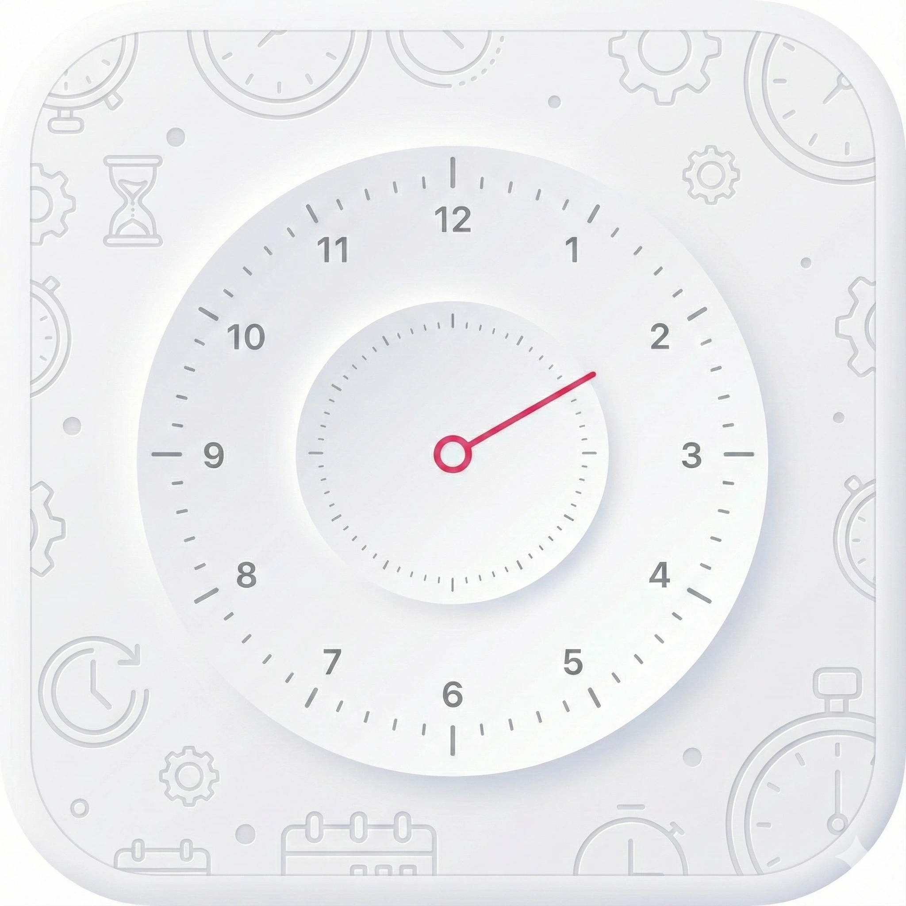
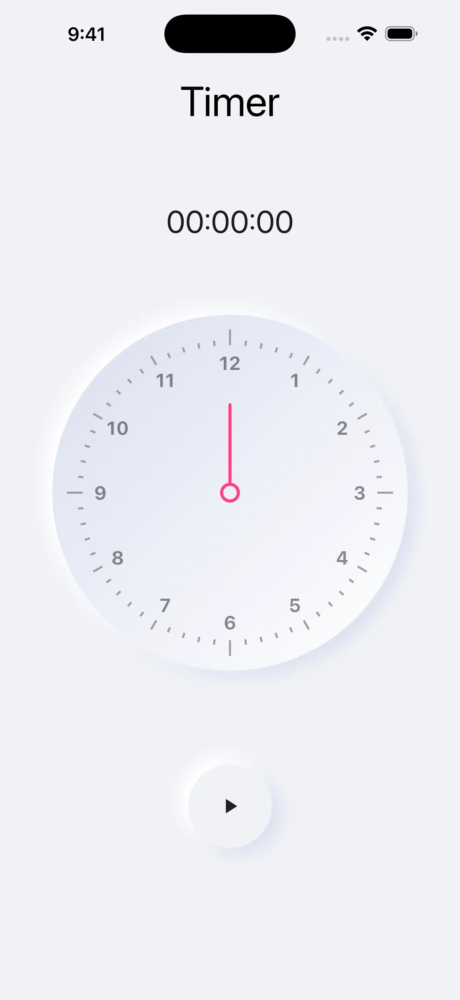
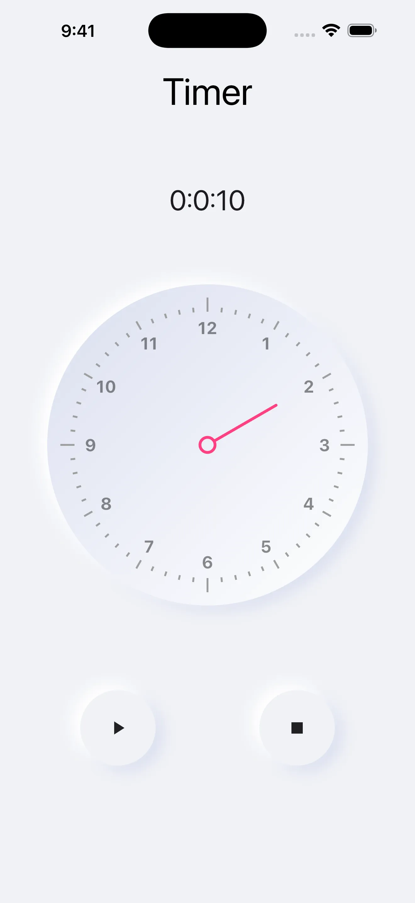
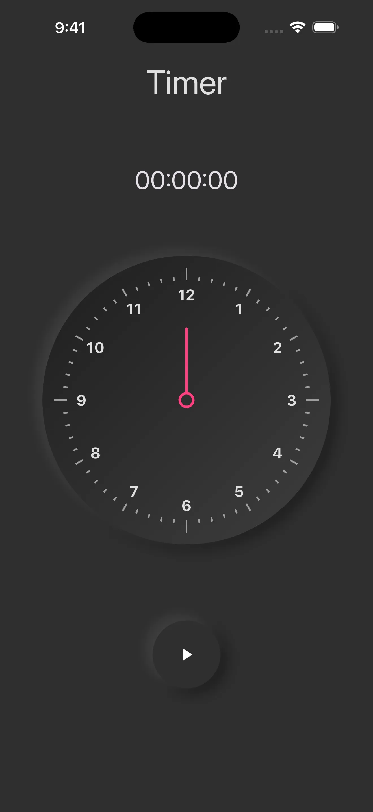
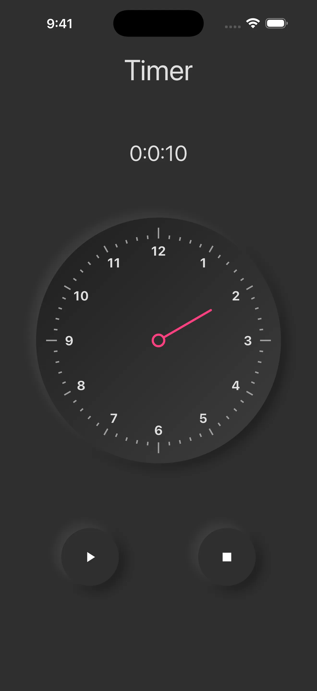

# ⏱️ Stopwatch - Neumorphic Clock & Timer App

A beautifully designed Flutter application featuring a stopwatch and analog clock with a modern neumorphic UI design.

[](https://flutter.dev)
[](https://dart.dev)
[](LICENSE)

## ✨ Features

-   ⏱️ **Stopwatch** - Precise timing with start, stop, and reset functionality
-   🕐 **Analog Clock** - Beautiful analog clock display with real-time updates
-   🎨 **Neumorphic Design** - Modern, sleek soft UI design that's easy on the eyes
-   🌗 **Dark/Light Theme** - seamless adaptability to system theme preferences
-   📱 **Portrait Mode** - Optimized for portrait orientation

## 📸 Screenshots

<table>
  <tr>
    <td></td>
    <td></td>
  </tr>
  <tr>
    <td></td>
    <td></td>
  </tr>
</table>

## 🛠️ Tech Stack

-   **Framework:** Flutter 3.10.3+
-   **Language:** Dart 3.10.3+
-   **State Management:** Flutter BLoC
-   **UI Library:** Custom Neumorphic Styling, Google Nav Bar

### Key Dependencies

-   `flutter_bloc` - State management
-   `analog_clock` - Analog clock widget
-   `google_nav_bar` - Modern navigation bar
-   `flutter_svg` - SVG image support

## 🚀 Getting Started

### Prerequisites

-   Flutter SDK (3.10.3 or higher)
-   Dart SDK (3.10.3 or higher)
-   iOS Simulator / Android Emulator / Physical Device

### Installation

1. **Clone the repository**

    ```bash
    git clone https://github.com/shenmareparas/Stopwatch.git
    cd Stopwatch
    ```

2. **Install dependencies**

    ```bash
    flutter pub get
    ```

3. **Run the app**

    ```bash
    # Check available devices
    flutter devices

    # Run on a specific device
    flutter run -d <device-id>

    # Or simply run on the default device
    flutter run
    ```

### Platform-Specific Setup

#### iOS

```bash
cd ios
pod install
cd ..
flutter run
```

#### Android

Make sure you have Android SDK installed and configured. Then:

```bash
flutter run
```

## 📁 Project Structure

```
lib/
├── main.dart              # App entry point
├── view/
│   ├── splash_view/       # Splash screen
│   ├── clock_view/        # Analog clock
│   └── stopwatch_view/    # Stopwatch feature
└── ...

assets/
└── icons/                 # App icons
```

## 🎯 Usage

1. **Stopwatch**: Tap the stopwatch tab to access timing features
2. **Clock**: View the current time on a beautiful analog clock
3. **Navigation**: Use the bottom navigation bar to switch between features

## 🤝 Contributing

Contributions are what make the open-source community such an amazing place to learn, inspire, and create. Any contributions you make are **greatly appreciated**.

1. Fork the Project
2. Create your Feature Branch (`git checkout -b feature/AmazingFeature`)
3. Commit your Changes (`git commit -m 'Add some AmazingFeature'`)
4. Push to the Branch (`git push origin feature/AmazingFeature`)
5. Open a Pull Request

### Development Guidelines

-   Follow the [Flutter style guide](https://dart.dev/guides/language/effective-dart/style)
-   Write meaningful commit messages
-   Add tests for new features
-   Update documentation as needed

## 🐛 Bug Reports & Feature Requests

If you encounter any bugs or have feature requests, please [create an issue](https://github.com/shenmareparas/Stopwatch/issues) with:

-   Clear description of the issue/feature
-   Steps to reproduce (for bugs)
-   Expected vs actual behavior
-   Screenshots (if applicable)

## 📝 License

This project is licensed under the MIT License - see the [LICENSE](LICENSE) file for details.

## 👤 Author

**Paras Shenmare**

-   Email: shenmareparas@gmail.com
-   GitHub: [@shenmareparas](https://github.com/shenmareparas)

## 🙏 Acknowledgments

-   Flutter team for the amazing framework
-   All contributors to the open-source packages used in this project
-   The Flutter community for inspiration and support
